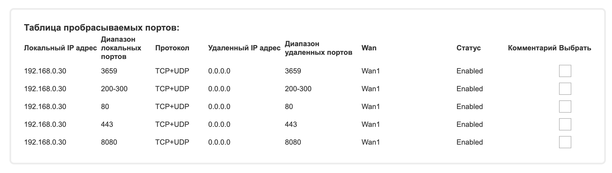
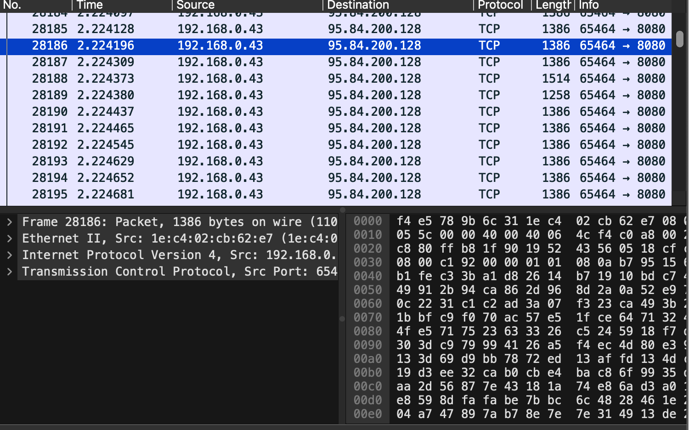
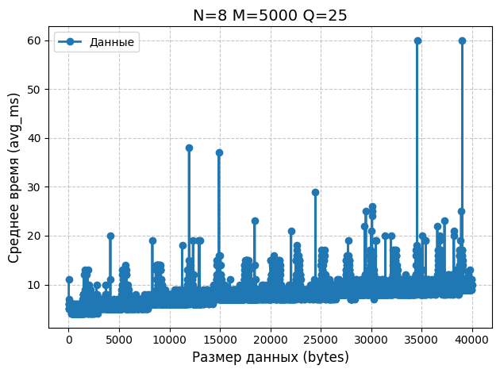

# HW 1

Бабушкин Владимир Александрович, БПИ237, @babushkin05 (tg)

## цель работы
Целью работы является подсчет результатов скорости передачи данных по сети с сервера на клиента.

## оценка
Я претендую на оценку 10 (9 с учетом штрафа просрочки дедлайна на 1 день), потому что выполнил все условия. Генеративный ИИ не был использован.

## код

исходный код на java лежит в [./client](./client/) и [./server](./server/). Это maven проекты. Клиент создает каждый раз файл с названием ***results.csv***, но я его руками переименовываю в ***case1.csv*** и т.д.

## как проводил эксперимент

еще в прошлом году я собирал себе дешевенький домашний сервер ради интереса, поэтому запускал на нем

Исходный код доставил на сервер используя удаленный git репозиторий.

в настройках роутера добавил проброс порта 8080 на мой сервер (предыдущие пробросы я делал для сайта, ssh и другое)

таким образом на публичном ip моего роутера (я доплачиваю за статичный) по порту 8080 будет доступен сервер на джаве который я написал в предыдущем пункте.

Чтобы действовать не внутри локальной сети роутера, на своем ноутбуке я включил Нидерландский VPN, так физическое расстояние, которое проходит информация сильно увеличивается

скрин wireshark с клиента

Действительно, 95.84.200.128 это ip моего сервера (можно проверить этот ip принадлежит домену babushkin05.ru)

## результаты

графики рисовал не в экселе, а в юпитер ноутбуке, мне так удобнее. Исходный код ноутбука прикреплен.

мы можем заметить много выбросов в графике, но и с ними понятен основной его принцип, при росте размера передаваемого значения, время его передачи растет медленно. Особенно заметны увеличения времени постепенное с шагом увеличивающимся в 2 раза, кажется, это связано с размерами передаваемых пакетов (они округляются вверх до степени двойки)